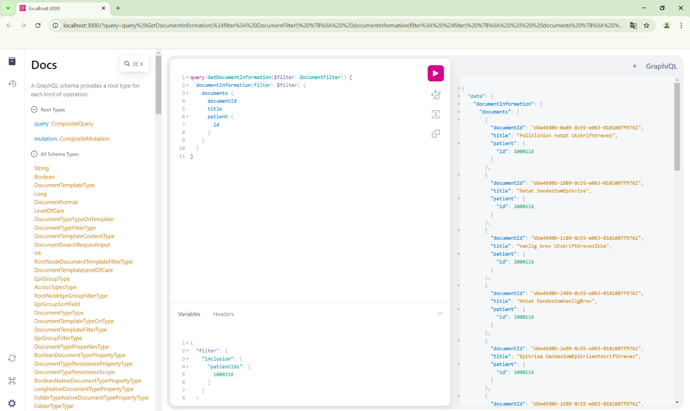

# GraphiQL

> ℹ️ From GraphQL 8.x, GraphiQL 3.x will be used.

[GraphiQL](https://github.com/graphql/graphiql) is an interactive, in-browser GraphQL IDE.
It's a fantastic developer tool that helps you form queries and explore your schema and documentation.
You can try it out with a <a href="https://graphql.github.io/swapi-graphql" target="_blank">live demo here</a>.



## Adding GraphiQL to Your ASP.NET Core App
The easiest way to add GraphiQL to your ASP.NET Core app is to use the
<a href="https://www.nuget.org/packages/GraphQL.Server.Ui.GraphiQL" target="_blank">GraphQL.Server.Ui.GraphiQL</a> NuGet package.
Once installed, simply add the following line to your `Program.cs` or `Startup.cs`:

```csharp
app.UseGraphQLGraphiQL();
```

By default, GraphiQL will be available at `/ui/graphiql`.

## Custom configuration

### Changing the GraphiQL path
To change the default path from `/ui/graphiql`, pass a custom path to the `UseGraphQLGraphiQL()` method.

Example:
```csharp
app.UseGraphQLGraphiQL("/my/own/path/to/graphiql");`  
```

### Changing the GraphQL endpoint
To change the default GraphQL endpoint from `/graphql`, set a custom endpoint using the `GraphiQLOptions.GraphQLEndPoint` property

Example:
```csharp
var graphiQLOptions = new GraphiQLOptions { GraphQLEndPoint = "/my/own/graphql/endpoint" }
app.UseGraphQLGraphiQL(options: graphiQLOptions);`  
```

### Adding HTTP headers
You can initialize GraphiQL with custom HTTP headers, such as providing a default JWT token for authentication, by setting the `GraphiQLOptions.Headers` property.

Example:
```csharp
var graphiQLOptions = new GraphiQLOptions
{
    Headers = new Dictionary<string, string>
    {
        {"Authorization", "Bearer <your-jwt-token>"}
    }
};

app.UseGraphQLGraphiQL(options: graphiQLOptions);`  
```

## Additional Resources
You may find GraphiQL example in [graphql-dotnet](https://github.com/graphql-dotnet/graphql-dotnet/blob/master/src/GraphQL.Harness/Startup.cs) repo.
[This ASP.NET Core sample project](https://github.com/graphql-dotnet/examples/tree/master/src/AspNetCoreCustom) also provides an example of hosting
the GraphiQL IDE with a little more effort.

